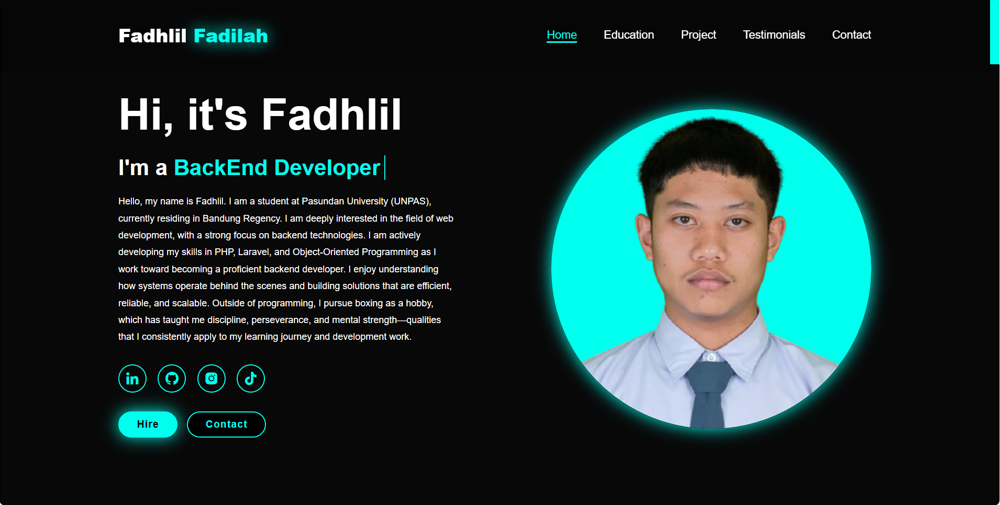
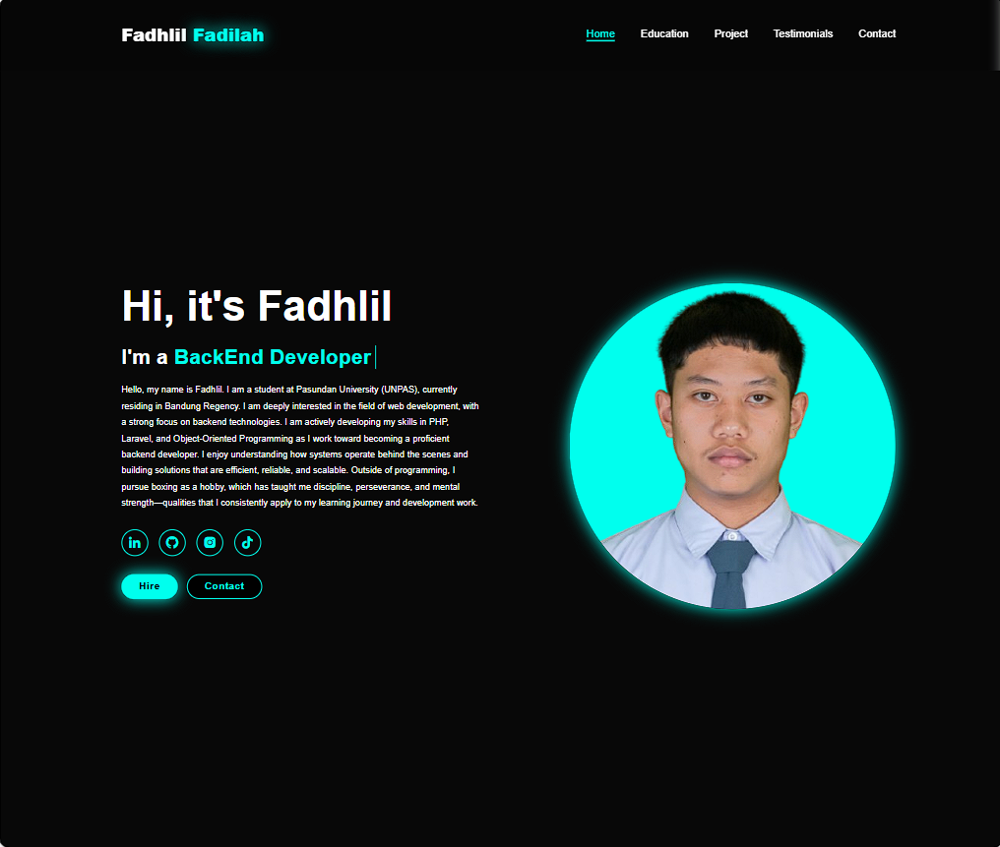
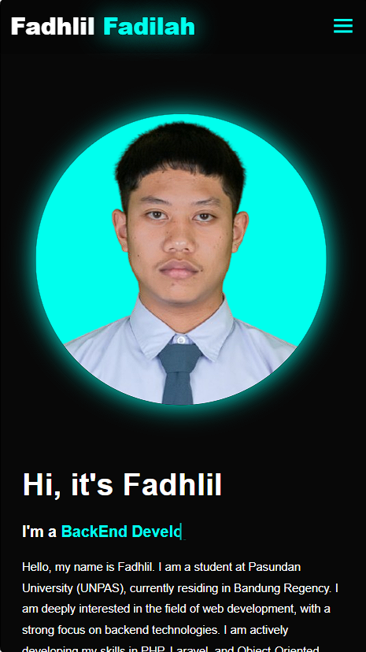

# PORTFOLIO MOCH FADHLIL FADILAH

   Proyek ini adalah pembuatan website portofolio pribadi yang responsif menggunakan HTML, CSS, dan JavaScript, bertujuan untuk menampilkan profil dan karya secara menarik di berbagai ukuran layar. Website ini membantu memperkenalkan identitas digital serta meningkatkan daya tarik profesional secara online.

## 🚀 Fitur Utama

* Fitur 1 — Tampilan responsif di semua perangkat
            Desain website yang otomatis menyesuaikan tampilan ketika dibuka di desktop, tablet, atau smartphone.
* Fitur 2 — Bagian “Tentang Saya” dan portofolio karya
            Ada bagian khusus untuk menampilkan profil diri, keterampilan, pengalaman, dan proyek-proyek terbaik kamu.
* Fitur 3 — Navigasi interaktif + kontak
            Menu navigasi yang mudah digunakan dan bagian kontak (misalnya email/tautan sosial media) supaya pengunjung bisa menghubungi kamu.

## 🛠️ Teknologi yang Digunakan

* HTML
* CSS 
* JavaScript

## 📂 Struktur Folder

```
/itw2025_project1_253040072/
├─ asset/
│  ├─ img/
│  └─ projek img/
├─ index.html
├─ script.js
├─ style.css
├─ image-1.png
├─ image-1.png
├─ image.png
└─ README.md
```

## ⚙️ Cara Menjalankan Proyek

1. Clone repository ini:

   ```bash
   git clone https://github.com/fadhil9898/itw2025_b_253040072.git
   ```
2. Masuk ke folder proyek:

   ```bash
   cd itw2025_b_253040072
   ```
3. Buka file `index.html` di browser atau jalankan dengan live server.

## 📸 Preview

1. Display Desktop


2. Display Tab


3. Display Phone


## 📌 Tujuan Proyek

Proyek ini dibuat untuk:

* Tugas Kuliah
* Media pembelajaran
* Latihan pengembangan web
* Portofolio pribadi

## 👤 Author

**Nama:** Moch Fadhlil
**Universitas:** UNIVERSITAS PASUNDAN
**Jurusan:** Teknik Informatika

✨ Jika kamu merasa proyek ini bermanfaat, jangan lupa beri ⭐ di repository ini!
